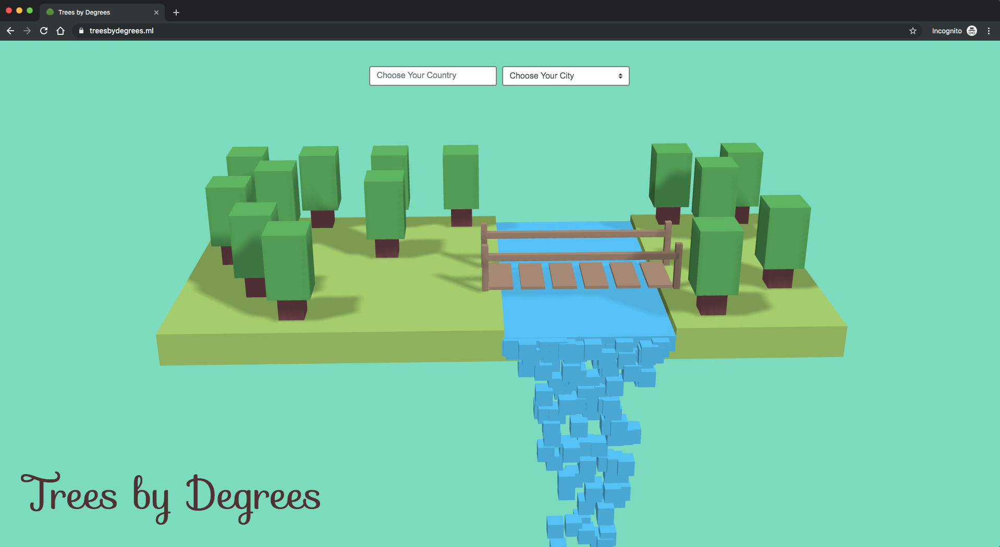
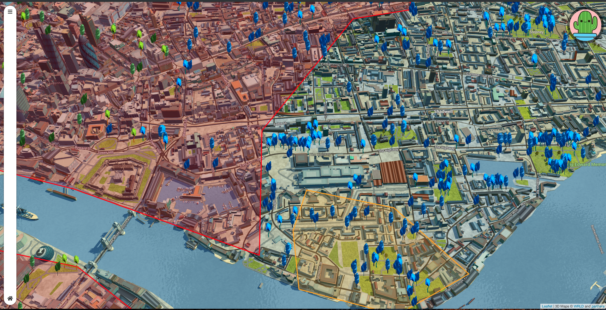
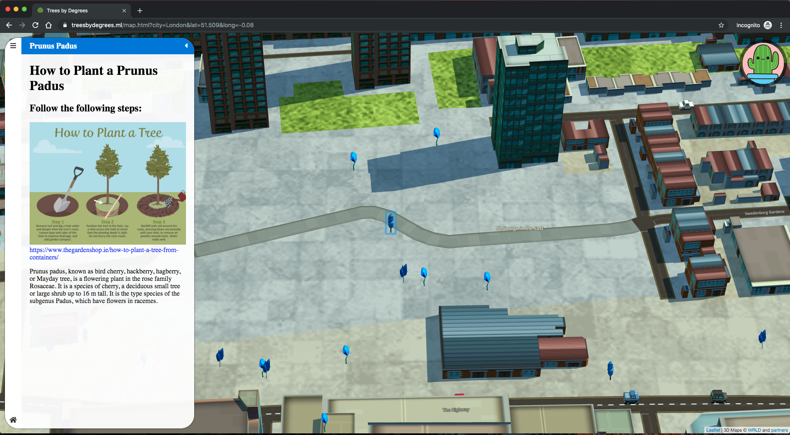

# Trees by Degrees at NASA Space Apps Dublin 2019

Planting trees in global hotspots to reduce local temperatures. We use NASA data to identify the most critical locations!

* [Slides for NASA Hackathon @ Baily Labs, October 2019](https://docs.google.com/presentation/d/1xrDjWhTVvTT2yY43wilW4smr_R9s079j8K5ySGh3DA0/)
* [Twitter](https://twitter.com/treesbydegrees)

## Technologies

* Javascript
* [Leaflet](https://leafletjs.com/)
* [wrld.js](https://docs.wrld3d.com/wrld.js/latest/docs/examples/) by [WRLD](https://www.wrld3d.com/)

## Development

Start a Python server if needed by:
```
$ python -m SimpleHTTPServer 8000
```
and open http://localhost:8000/ in your preferred browser

## Deployment

Deployment has been done with Github Pages

## Figures

**Where to plant trees using Computer Vision:**


**Website:** https://treesbydegrees.ml/


**Green trees represent existing trees!**


**Blue trees represent trees that can be planted!**


**How to plant one of the proposed trees:**

